# Workshop-Ionic

Notre but :


Bonjour à tous et bienvenue à ce Workshop Ionic, dans lequel nous allons développer une **ToDO List** grâce à l'environement Ionic, avec une base de donnée **FireBase**, en respectant une architecture **Angular.**

Pour ce faire, nous allons suivre ensemble toute une série d'étapes pour au final pouvoir créer des taches, les afficher et les supprimer.

Le tout en utulisant des balises <ion- .... >

## Installaton du projet

Pour commencer installer **Ionic** en glbal avec la commande
`npm install -g ionic`

Ca va mettre un peu de temps à s'installer.

Ensuite lancer le projet ou vous voulez dans votre ordinateur en tapant dans le terminal `ionic start Todolist blank`.

Tous les fichiers nécessaires se créent.

Le fait de mettre le " blank " va faire en sorte d'avoir un projet "vide". A la place, on peut mettre "tabs" pour une interface avec plusieurs onglets, "conference" pour un site avec toutes une séries de fonctuionnalité pré-faites, comme une carte, un calendrier etc ...
De notre coté, on va tout faire à la main en commençant de "rien".

Pour finir taper `ionic serve`.

Vous êtes maintenant prêts à rentrer dans le vif du sujet: le code de notre application.

## Créeer son thème

Pour commencer on peut faire un tour de l'architecture, on se rends compte que c'ets une architecture Angular. Pas de panique, ici nous n'irons pas dans les méandres du _routing_ angular, nous allons juste utiliser l'architecture pour insérer toutes nos fonctionnalités.

Comme vous pouvez le voir, les feuilles de style sont en scss, donc lancer votre plugin "Live Sass Compiler" afin de compiler en direct.

Nos efforts vont se concentrer sur les .ts, .html et .scss du dossier `home`, avec quelques détours pour quelques lignes, mais tout sera expliqué (je l'espère) dans ce tuto.

Maintenant que vous êtes un peu familier avec notre environnement de travail, rendez-vous dans `src/app/home/home.page.htlm`.

Pour commencer, changez le titre de l'application.

Dans la balise `<ion-title> [Votre prénom]'s Todolist</ion-title>`.

Ensuite, allez dans le ficher `src/theme/variable.scss` et changer la première valeur (--ion-color-primary) pour la mettre en #5a8ca4.

Ici on peut voir que Ionic possède toute une série (9) de couleur de base pré-enregistrées qui peuvent être utilisée plus facilement. Ces couleurs possèdent aussi des variantes (contrast, shade et tint) qui sont utilisable.

Nous verrons comment les intégrer facilement au HTML plus tard.

```
<ion-toolbar color="primary">
  <ion-title>
    Todolist
  </ion-title>
</ion-toolbar>
```

Voila, notre en-tête est toute belle.

A présent, téléchargez l'image "bg" des assets.

Videz l'intérieur des balises `<ion-content>` et y intégrer une div ayant comme class "bg-img".

Ensuite, allez dans `src/app/home/home.page.scss` et mettez

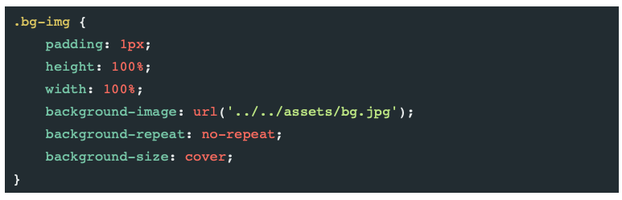

Maintenant que nous avons un visuel, nous allons injecter les premières valeurs

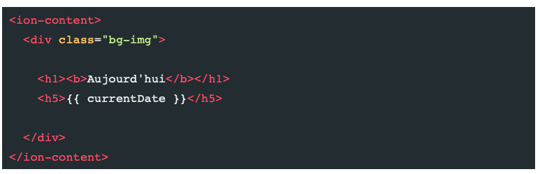

On va réglé le problème de currentDate plus tard.

Vous pouvez bien sûr changer les textes avec par exemple "Bonjour [Votre prénom]"

Mettre un peu de style:

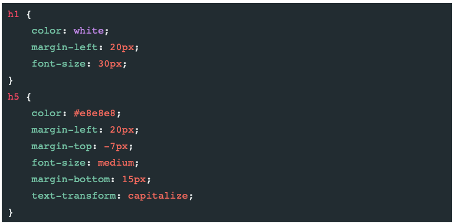

Pour finir cette partie, allez dans le fichier `src/app/home/home.page.ts`.

Dans export, déclarer currentDate comme étant une string :

```
export class HomePage {
    currentDate: string;

```

Et dans le constructor, ajouter la variable current date grâce à l'objet date de JavaScript

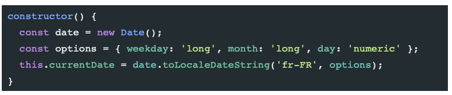

A présent, vous devriez avoir ceci:


Vous avez terminez la première étape: Bravo !!!!

On passe à la suite.

## Connecter son applicaton à FireBase

Pour ce faire, vous devrez commencer par avoir un compte google et vous rendre sur le site de [FireBase](https://firebase.google.com).

Ensuite, dans un nouvel onglet du termninal, faites la commande `npm install firebase @angular/fire --save`

Une fois ce package installé, allez dans `src/app/app.module.ts`.

Ici, nous allons importer d'une part **AngularFireModule** qui va associer notre application Ionic avec Firebase, et d'autre part **AngularFireDatabaseModule** pour utiliser les fonctions associées aux bases de données de Firebase.

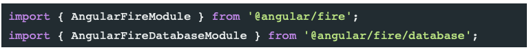

Maintenant nous allons connecter Firebase à notre application.

Pour commencer, sur firebase, connectez-vous grâce à votre compte google.

Vous avez alors accès à la console. Clique sur "ajouter un projet", entrer le nom de votre projet, suivant, activer Google Analytics, suivant, accepter tout et créer le projet.

Ca peut prendre un peu de temps.
Vous avez alors accès à votre projet.

Pour faire le liaison avec votre appli,cliquez sur l'onglet web dans l'ajout d'application

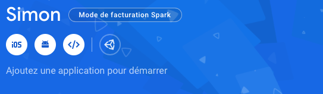

Vous entrez un nom, et cliquez sur enregistrer l'application.

Vous avez alors un bloc de code, copiez-collez la partie `var firebaseConfig = {

Différents code

}`

et collez ce code dans l'export de l'export de `src/app/app.module.ts`.

Il faut ensuite déclarer ces packages.

Vous devez arriver un fichier qui ressemble à ça:

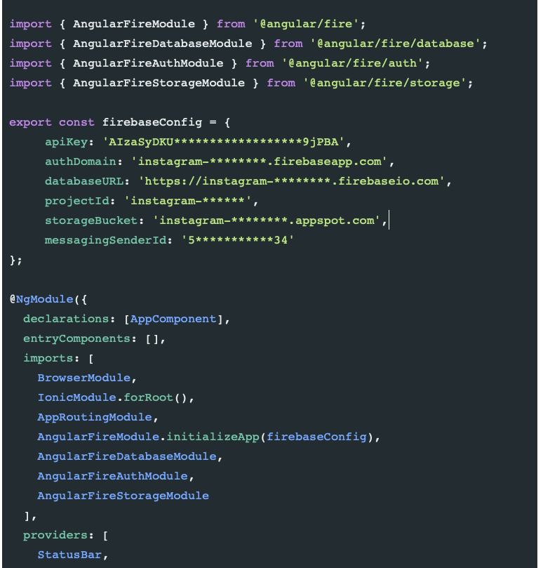

NB: grace à la fonction initializeApp, notre projet est lié à l'app.

A présent, allons dans la partie Database que vous trouvez dans dans l'onglet Développer (sur la gauche).

Cliquez sur "Créer une base de données", continuer en mode production, puis changez votre région en "eur3 (europe-west)".
De nouveau, ça prend un peu de temps.

Ensuite, c'est important: tout en haut, à coté de "Database", **passer de Cloud Firestore à RealTime Database !!!**

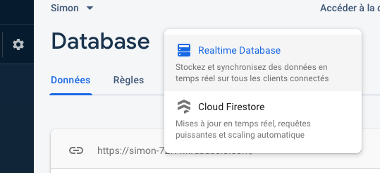

Retour dans le code pour finir cette liaison.

Dans `src/app/home/home.page.ts` importez le module _AngularFireDatabase_ :

`import { AngularFireDatabase } from '@angular/fire/database';`

et déclarez ce module dans le constructor() pour povoir l'utiliser dans le reste de la page.

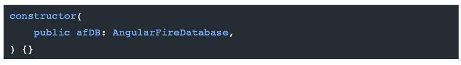

Voila, la liaison est finie.
C'est la partie la moins marrante et la plus abstraite, donc si vous êtes arrivé ici, ben vous êtes une re-sta et bravo !!
Au niveau du visuel, rien n'a changé, mais derrière tout fonctionne à présent!!

NB: Regardez quand même dans la console de l'inspecteur que rien ne soit cassé, c'est hautement probable.

## Ajouter une tâche à notre TodoList

Vous me direz: "T'es bien gentil Simon, mais on est loin du résultat". Je sais, donc je vous dis "Fooooooonce, le temps file et je passe pas ma journée ici !!! "

En avant pour une meilleure partie: l'ajout de tâche.

C'est à partir de cette partie que vous allez voir le plus de "particularités" d'**Ionic** et les avantages disponibles. Je vais en expliquer quelques dans le texte, mais il y en aura d'autres que je vous laisse découvrir.

Excusez-moi déjà pour le grand nombre de photo mais c'est plus simple et plus explicite qu'un long texte.

Pour commencer, nous allons créer un formulaire d'envoi qui contiendra simplement un champ de texte, et plus tard un bouton de validation.

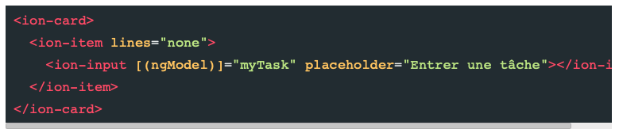

Petite explication:

- Le `lines="none"` re-style un peu le champ (esssayez sans pour voir la différence).
- le `[(ngModel)]="myTask"` sert à lié avec la partie .ts pour utilisé `myTask`.

On va donc aller déclarer le myTask en tant que string sous le currentDate.

Ajoutons à présent le bouton "ajouter" en insérant ce bout de code dans l' `ion-input` déjà là.

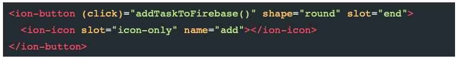

C'est ici qu'on rencontre pour la première fois les icones Ionic.

En effet, Ionic possède une bibliothèque d'icônes que l'on peut appeler avec leur nom. Ici: `name="add"`.

La liste des icones disponibles et pré-enregistrées est sur la [doc](https://ionicons.com).

Nous voyons aussi pour la première fois une commande très utile pour le placement: le `slot`. Elle permet de placer un objet. Icon-only, je sais pas ce que ça veut dire, mais il y a aussi end et start qui sont très utilisés et qui mettre à gauche et à droite.

Ionic utilise déjà les nouvelles pratiues CSS (cf veille de Rimbaud.)

Enfin, le `(click)="addTaskToFirebase()"` appelle au click la fonction que nous allons implanter dans le fichier .ts

Encodez ce code dans le fichier `home.page.ts`, sous le constructor (après les accolades du constructor).

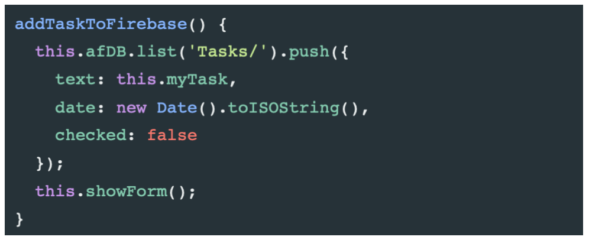

Je vous laisse comprendre ce que fait cette fonction. J'expliquerai juste que `afDB` est la fonction de liaison à Firebase quqe nous avons déjà déclarer un peu plus haut dans le constructir. C'est grâce à cette déclaration que nous pouvons le réutiliser ici.

Ensuite nous détaillons les champs créés dans Firebase lors de l'appel de `addTaskToFirebase()`.

Maintenant, exécutons la foncton `showForm()`qui va cacher ou montrer le formulaire d'envoi. Ainsi, lorsque que nous envoyons une nouvelle tâche, nous revenons à la page d'acceuil.

Pour commencer, déclarez dans l'export la variable addTask en boolean :

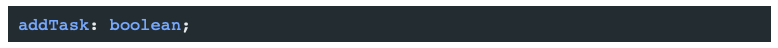

Ensuite appelez cette variable dans le fonction showForm():

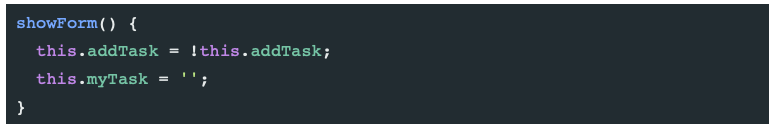

Grâce à cette fonction imbriquée dans le fonction addTaskToFirebase(), à chaque appel à cette dernière, nous inversons la valeur de `addTask` et nous mettons `myTask`, c'est à dire la nouvelle tâche à encoder à du vide.

Maintenant que la fonction pour afficher ou montrer cette option est implémantée, il nous faut créer le bouton qui va faire cette action.

Hors de notre balise `<ion-card>`, ajouter ce code :

```
<ion-button *ngIf="!addTask" (click)="showForm()" expand="block" class="add-button">
  <ion-icon name="add" slot="start"></ion-icon>
  Ajouter une tâche
</ion-button>

<ion-button *ngIf="addTask" (click)="showForm()" expand="block" class="add-button">
  <ion-icon name="close" slot="start"></ion-icon>
  Annuler
</ion-button>
```

Nous introduisons ici le \*ngIf, preuve qu'Angular est assez utile dans contexte pour changer l'affiche d'élément en fonction de la variable `addTask`.
Sur le click, nous appelons également la fonction `showForm()` qui va justement changer la valeur de cette donnée.
On peut voir également toute une série de fonctionnalité propres à Ionic, comme l'appel d'icones, le principe des "slot" ou un expand.

Mettez un peu de style à tout ça, par exemple:

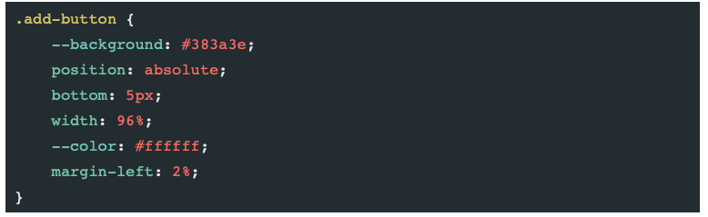

Bravo, vous êtes capables d'ajouter des tâches, tout du moins sur le visuel. Vous devriez avoir un écran qui ressemble à celui-ci:

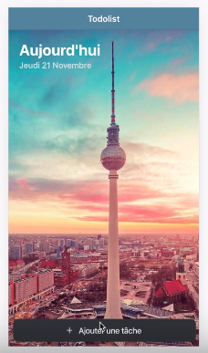

et au click sur le bouton d'ajout, vous avez ce visuel:

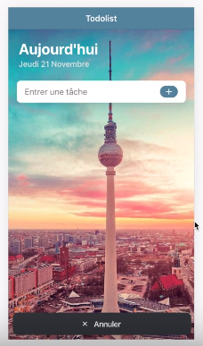

Mais ce n'est pas assez, on va pousser le truc un peu plus loin.

## Afficher nos Tâches sur notre écran

C'est bien beau d'encoder des tâches, mais si rien ne s'affiche pour nous rappeler de la faire, ça sert pas à grand chose. C'est notre mission pour cette étape.

Commençons par créer la variable `tasks= []`dans `home.page.ts`.

Nous allons utiliser ce tableau pour y pusher nos données et pouvoir les ressortir à l'affichage.

Pour ce faire, créez la fonction getTasks():

```
getTasks() {
  this.afDB.list('Tasks/').snapshotChanges(['child_added', 'child_removed']).subscribe(actions => {
    this.tasks = [];
    actions.forEach(action => {
      this.tasks.push({
        key: action.key,
        text: action.payload.exportVal().text,
        hour: action.payload.exportVal().date.substring(11, 16),
        checked: action.payload.exportVal().checked
      });
    });
  });
}
```

Analysons ce code:

- `this.afDB.list('Tasks/')` : nous travaillons dans Firebase dans la base de donnée appelée Tasks.
- `snapshotChanges(['child_added', 'child_removed'])` : pour chaque moification, nous refaisons un check dans la db.
- `this.tasks = [];`: Dans quel tableau je mets mes tâches.
- `actions.forEach(action => { this.tasks.push({` : pour chaque élément, pusher dans notre tableau tasks.
- `hour: action.payload.exportVal().date`: valeur du payload du champs date de notre objet. Ce champs est définit un peu plus haut, lors de la fonction `addTaskToFirebase()`.
- `.substring(11, 16)`: ne prendre que les caractères du 11ieme au 16ieme afin de ne rendre que l'heure.

Avec ces informations, vous devriez comprendre tout le bloc.<br>
Si ce n'est pas le cas, vous pouvez me poser la question, j'essaierai de vous aider.

Pour afficher sur l'écran notre liste de tâches, nous devons tout de suite appeler la fonction `getTasks()` au chargement de la page. <br> Pour ce faire, il faut l'écrire dans le constructor:

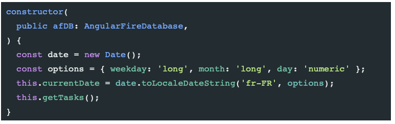

Voila, les taches sont disponibles, on peut le voir grâce à un petit `console.log("Task : " + this.myTask)` juste sous le `showForm()` pour vérifier dans notre inspecteur que tut va bien.

Affichons tout ça sur notre écran.

Pour ça, nous allons utiliser de nouveau la balise [`ion-card`](https://ionicframework.com/docs/api/card).

Dans `home.page.html`, entre la `<ion-card>` prévue pour l'ajout de tâche et le bouton du bas, ajoutez ce code :

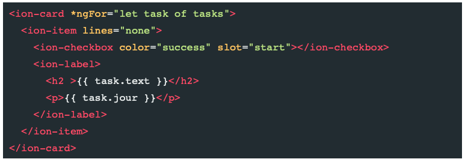

Explications:

- `*ngFor="let task of tasks"` : boucle pour afficher toute la liste de tâches et pas une seule.
- `color="success"`: une nouvelle couleur (vert) pré-enregistrée dans Ionic. De plus, comme est elle dans une check-box, elle ne se mettra que quand la check-box sera "successfull", c'est à dire qu ela tâche sera remplie.
- `<ion-checkbox>`: une balise ion toute prete pour des checker-box.
- `{{task.text}}` : aller rechercher la donnée text déclarée dans `home.page.ts`

Créons un petit bouton dans notre Header pour pouvoir recharger notre page, et p-e dans le futur pouvoir partager cette Todo list.

Pour ce faire, il suffit de créer un bouton dans le header et de lui faire appeler `getTasks()`, la fonction qui fait l'affichage des tâches.

Voila à quoi ressemble notre header dans `home.page.html` à présent :

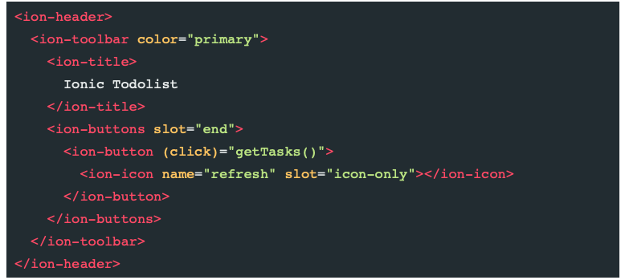

Nous avons enfin un todolist qui ressemble à quelque chose !!, elle devrait ressembler à ça:

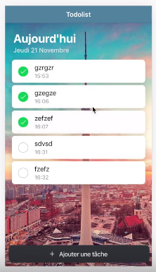
